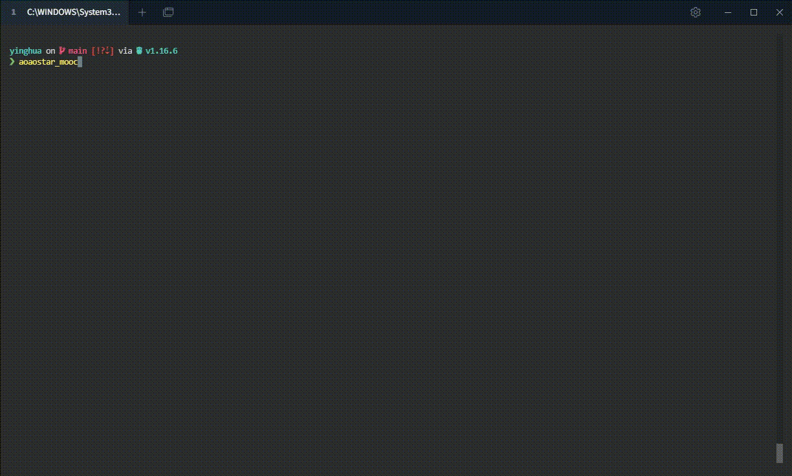
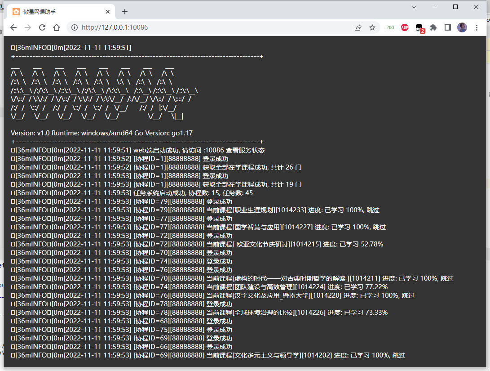

## 说明

英华学堂网课助手客户端版本  
作者: Pluto  
禁止二次售卖, 仅供学习与交流


## 演示



### web端



## 使用

在`releases`页面下载最新版, 到电脑
* 直达: <https://github.com/aoaostar/mooc/releases/latest>   

重命名`sample.config.json`为`config.json`
配置好`config.json`, 直接双击运行即可  
打开`http://127.0.0.1:10086`可以在浏览器查看服务状态

### 配置

> 使用`mooc.yinghuaonline.com`时`school_id`为必填项  
> 使用自己学校的平台可以不填，默认为`0`  
> `server`网页端地址, `:10086`=> `127.0.0.1:10086`  
> `limit`协程数, 支持多门课程一起刷, 拉满可以以最快速度刷完  
> JSON编辑工具: <https://tool.aoaostar.com/json>
```json
{
  "global": {
    "server": ":10086",
    "limit": 3
  },
  "users": [
    {
      "base_url": "https://mooc.yinghuaonline.com/",
      "school_id": 0,
      "username": "username",
      "password": "password"
    }
  ]
}
```

#### 支持多账号

```json
{
  "global": {
    "server": ":10086",
    "limit": 3
  },
  "users": [
    {
      "base_url": "https://mooc.yinghuaonline.com/",
      "school_id": 0,
      "username": "username1",
      "password": "password1"
    },
    {
      "base_url": "https://mooc.yinghuaonline.com/",
      "school_id": 0,
      "username": "username2",
      "password": "password2"
    }
  ]
}
```